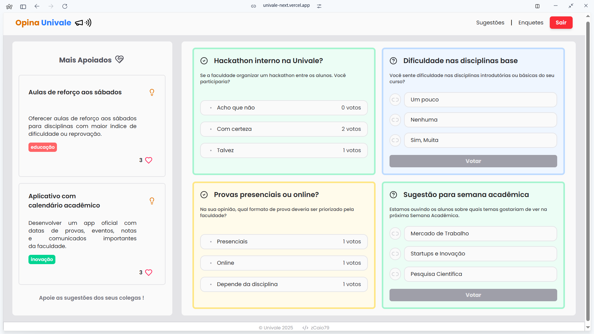
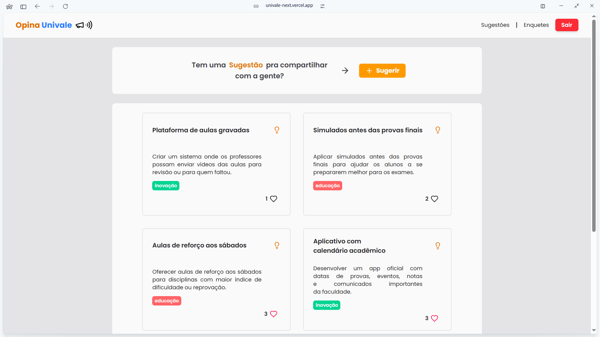
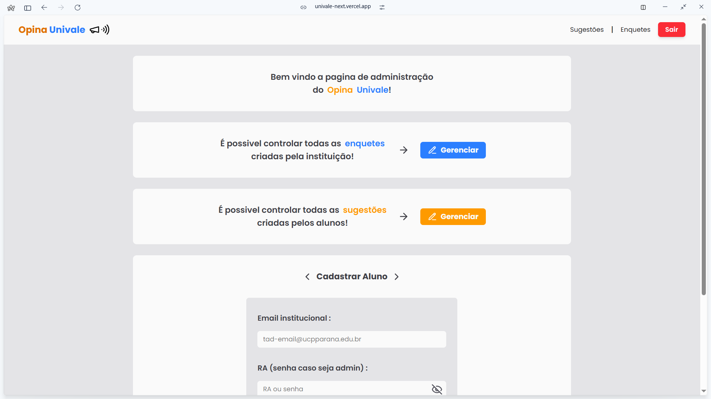
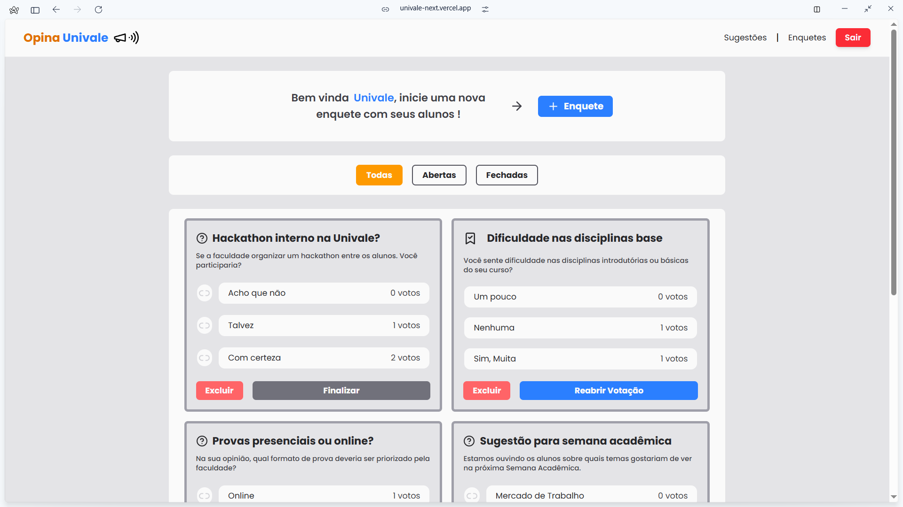

# 🗳️ Opina Univale

Sistema web desenvolvido como Trabalho de Conclusão de Curso (TCC) para o curso de Análise e Desenvolvimento de Sistemas da UNIVALE.

O **Opina Univale** permite que alunos da faculdade participem ativamente da vida acadêmica por meio de **enquetes** e **sugestões anônimas**, promovendo o diálogo e o feedback direto entre estudantes e administração.

> ✨ _“A opinião do aluno, no centro das decisões.”_

---


## 🔍 Visão Geral

A plataforma tem como objetivo centralizar opiniões, propostas e votações dos alunos, incentivando uma gestão mais participativa e aberta às necessidades da comunidade acadêmica.

---

## ✅ Funcionalidades

### 🎯 Para Alunos:
- Enviar **sugestões anônimas**
- Visualizar mural de sugestões públicas
- Apoiar sugestões com um clique
- Votar em **enquetes ativas**

### 🛠️ Para Administradores:
- Criar, ativar e finalizar enquetes
- Acompanhar sugestões e apoios
- Gerenciar contas de alunos e registros

---




## 🧑‍💻 Tecnologias Utilizadas

- **Next.js** (App Router)
- **TypeScript**
- **Tailwind CSS**
- **Supabase** (Auth + PostgreSQL)
- **Vercel** (Hospedagem)

---

## 🚀 Como Rodar o Projeto Localmente

```bash
# Clone o repositório
git clone https://github.com/seu-usuario/opina-univale.git

# Acesse o diretório
cd opina-univale

# Instale as dependências
npm install

# Crie o arquivo de variáveis de ambiente
cp .env.local.example .env.local
# (Preencha com suas chaves do Supabase)

# Inicie o servidor de desenvolvimento
npm run dev
